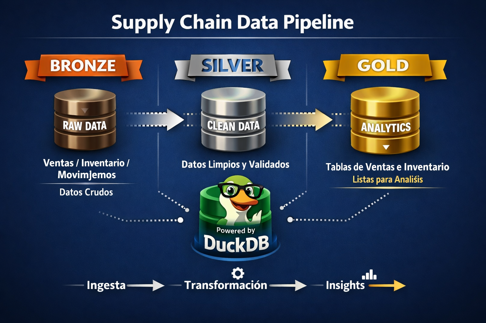

# scalable_supply_chain_analytics_pipeline
Producto analítico para retail y supply chain que integra ventas, inventario y movimientos en un modelo escalable para análisis, basado en arquitectura Medallion

# Scalable Supply Chain Analytics Pipeline

## Overview
This project builds an end-to-end data pipeline for retail supply chain analytics using Medallion Architecture (Bronze → Silver → Gold).

## Features
- Sales analytics
- Inventory tracking
- Movement analysis
- Power BI ready dataset

## Insights

### Cuando los datos no dicen nada…

Todo empezó con algo bastante común, muchos datos, pero poca claridad. Ventas por un lado, inventario por otro y movimientos separados, todos existían pero no estaban conectados. El problema real no era la falta de información, sino la falta de contexto para tomar decisiones. La idea de este proyecto fue precisamente esa, convertir datos dispersos en una visión clara del negocio, organizando todo en una arquitectura tipo Medallion (Bronze → Silver → Gold) para asegurar estructura, consistencia y confianza en los datos desde su origen.

 ### ⚙️ Conectar todo para entender el negocio

La parte más interesante fue unir  dimensiones clave , inventario, ventas y movimientos. Al integrarlos por semana, producto y ubicación, los datos empezaron a contar una historia completa del negocio. Ya no se trataba solo de “cuánto se vendió”, sino de entender qué estaba pasando realmente: productos con riesgo de quiebre de stock, exceso de inventario o movimientos que no impactaban ventas. A partir de ahí, el dashboard deja de ser visualización y se convierte en una herramienta de decisión, permitiendo responder preguntas.
